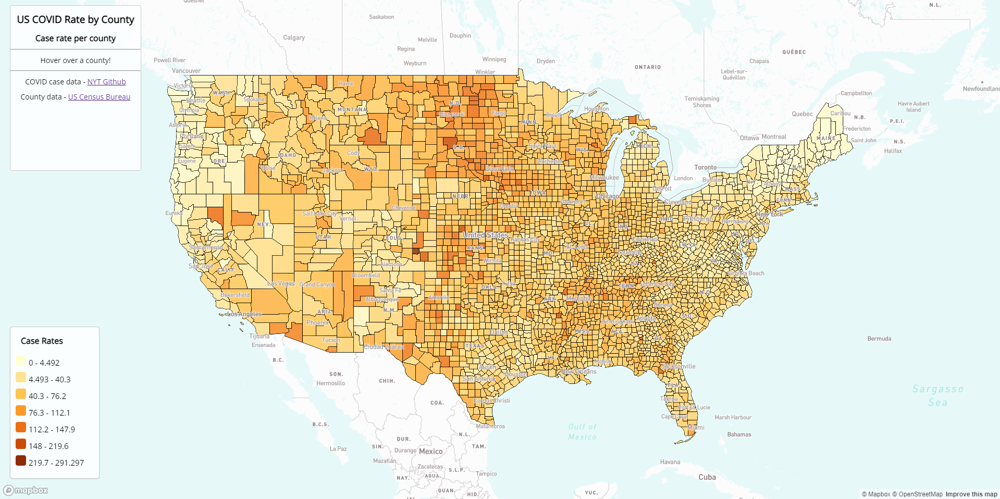
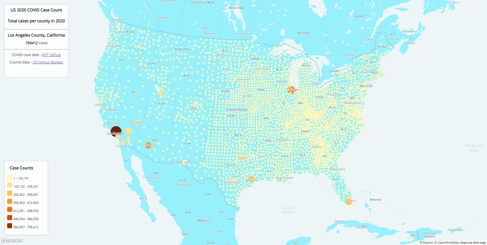

# 2020 COVID Rate/Case Maps (US)

This repo is used to host two maps created using Mapbox Studio visualizing COVID-19 counts and case rates in US counties. Rate map is a choropleth map and case count is a proportional symbols map.

Functions- to visualize where COVID rates and cases were the highest in 2020 and patterns. Hover over a county to see name, case rate, cases, and populaton in 2018 for the choropleth map. County color increases in intensity with case rate. Click on dots to show case count for a county in proportional symbols map. Dot size increases with case count. 

# Links and Screenshots
[Map 1 - Choropleth Map](https://reina-orikasa.github.io/geog458-covid-maps/map1.html)

[Map 2 - Proportional Symbols Map](https://reina-orikasa.github.io/geog458-covid-maps/map2.html)

 Map 1
 Map 2

# Data Sources
COVID Numbers from the [New York Times](https://github.com/nytimes/covid-19-data/blob/43d32dde2f87bd4dafbb7d23f5d9e878124018b8/live/us-counties.csv).

US County Data from the [US Census Bureau](https://data.census.gov/cedsci/table?q=county%20population%202018%20acs&tid=ACSDT1Y2018.B01003).

# Acknowledgment / Credit
See: https://github.com/jakobzhao/geog458/tree/master/labs/lab03 for assignment details.  
Maps created in [Mapbox Studio](https://studio.mapbox.com/)